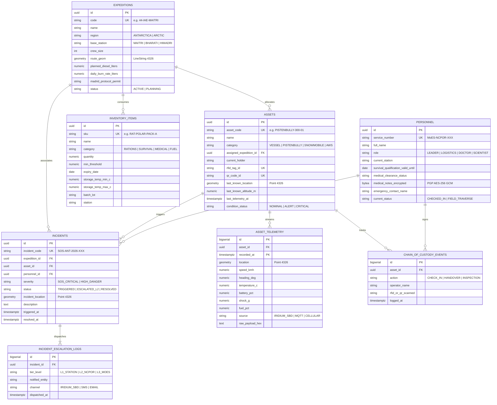

# IPE-LAMS Entity-Relationship Diagram (ERD)
**Ministry of Earth Sciences (MoES) & NCPOR Goa**
**System**: Integrated Polar Expedition Logistics and Asset Management System (SIH 2026)

### Data Sovereignty & Madrid Protocol Guarantees
1. **Medical Records Encryption**: Stored in `personnel.medical_notes_encrypted` using PGP symmetric AES-256 GCM, ensuring personal medical records comply with international polar research privacy standards.
2. **Spatial Indexing**: All geospatial coordinates utilize PostGIS SRID 4326 with GIST indexes enabling fast distance queries between PistenBully traverse convoys and Antarctic Specially Protected Areas (ASPA).
3. **Time-Series Partitioning**: `asset_telemetry` table is partitioned by month or Timescale hypertable chunks to efficiently handle high-frequency telemetry ingest over satellite links.
